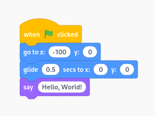

## NEW

[Goboscript](https://github.com/aspizu/goboscript) is a new way to write Scratch 
Projects in text form. When it reaches a stable release you may use it over 
Gobomatic. Goboscript depends on Gobomatic so development will continue on both 
projects.

<br>
<br>
<br>

# Gobomatic

Gobomatic is a Python library to generate Scratch (3>) projects from
Object-Oriented representation of Scratch projects in Python code.

## Example

A build.py file is used to build the Scratch project. It also defines the Stage
sprite.

build.py
```py
from gobomatic import *

from main import Self as main

stage = Sprite(
    "Stage",
    costumes = [
        "assets/blank.svg"
    ]
)

Self = Project(
    sprites = [
        stage,
        main
    ]
)

Self.export("project.sb3", debug=True)
```

Each sprite is defined in its own Python file.

main.py
```py
from gobomatic import *

Self = Sprite(
    name=__name__,
    costumes = [
        "assets/scratchcat.svg"
    ]
)

Self.WhenFlagClicked(
    Goto(-100, 0),
    Glide(0, 0, 0.5),
    Say("Hello, World!"),
)
```

### Resulting project code



## Documentation
[~/docs/docs.md](docs/docs.md)

## Contributing

You can help with the development of gobomatic by testing or writing documentation.

### Installation from source

clone the repository (You should fork the repository first!)
```
cd ~/Projects
git clone https://github.com/aspizu/gobomatic gobomatic-git
```

install the module in edit mode
```
cd gobomatic-git
pip install -e .
```

### Testing

Use [~/examples/testing](examples/testing) to test various Scratch code.

building the project
```
cd examples/testing
python build.py
```

open testing.sb3 in the Scratch editor to examine the result.

## Mentions

Thanks to [@DavidBuchanan314](https://github.com/DavidBuchanan314), They too are working on a similar project but with different goals [boiga](https://github.com/DavidBuchanan314/boiga) which was the inspiration for this project.
